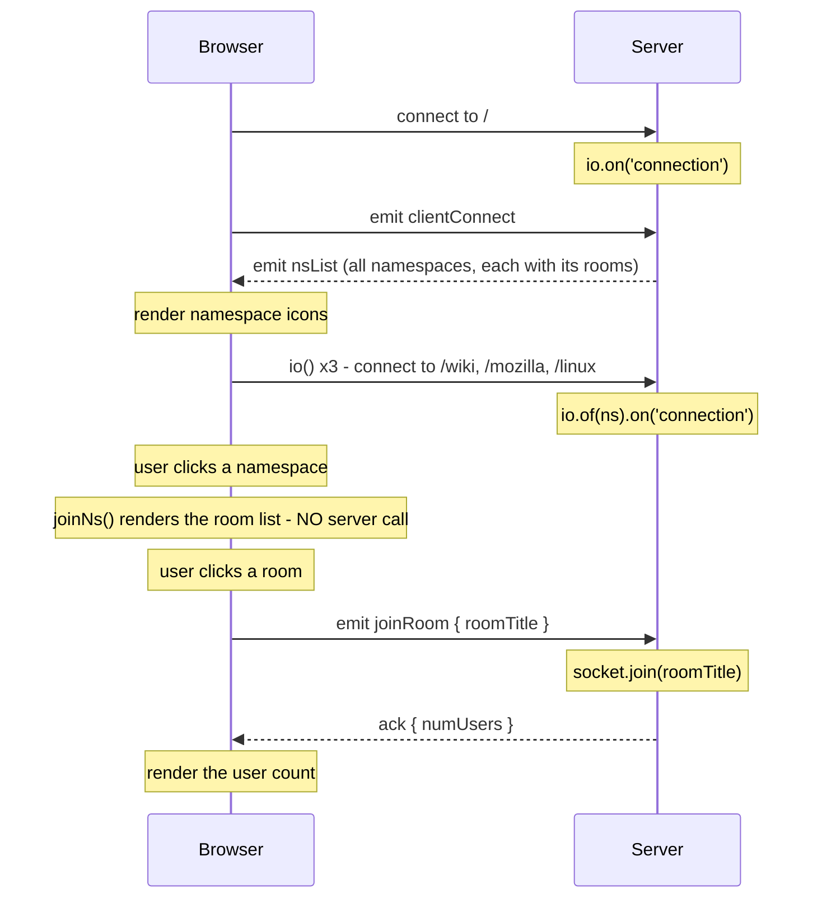

# socketio201

Course project: Socket.IO namespaces, rooms, and a Slack-style chat clone.
TypeScript on both server and client, with a shared contract between them.

Concept notes: **WebSocket & Socket IO — mental model** (Notion)
<!-- paste the link here -->

---

## Running

```bash
npm install

npm run dev:slack        # slack clone      → http://localhost:9000/slack.html
npm run dev:namespaces   # namespaces demo  → http://localhost:8001/namespaces.html
npm run typecheck        # checks BOTH tsconfigs
```

`dev:slack` runs two watchers at once: esbuild rebuilding the client bundle,
and Node re-running the server.

> There is no `index.html`, so `/` returns "Cannot GET /". Use the full filename.

---

## Layout

```
socketio201/
├── namespaces/                 # lesson demo — namespaces (port 8001)
│   ├── namespaces.ts
│   └── public/                 # client (inline <script>)
├── slackClone/                 # main project
│   ├── server/
│   │   ├── slack.ts            # server entry (port 9000)
│   │   ├── classes/            # Namespace, Room — domain models with behaviour
│   │   └── data/               # seed data
│   ├── contract/               # ← imported by BOTH sides
│   │   ├── dto.ts              #   the data shapes that cross the wire
│   │   └── events.ts           #   which event names exist, and what each carries
│   └── public/
│       ├── scripts.ts          # client source — EDIT THIS
│       ├── joinNs.ts           # imported by scripts.ts
│       └── scripts.js          # generated by esbuild — DO NOT EDIT (gitignored)
├── tsconfig.json               # server: nodenext, node types, no DOM
└── tsconfig.client.json        # client: bundler resolution, DOM, no node types
```

Three regions: **server**, **public** (browser), and **contract** (neither — it is
erased at build and exists only so both sides agree).

### Things that are easy to forget

- **Imports need explicit `.ts` extensions.** This is ESM resolved by Node, not a
  bundler. `./data` fails — it must be `./data/namespaces.ts`.
- **`contract/` is the single source of truth for event names.** A typo there breaks
  the build on both sides, which is the point.
- **The `Socket<...>` generics are flipped** between server and client:
  `Socket<ListenEvents, EmitEvents>` from each side's own point of view.
- **Classes `implement` the DTOs.** Add a field to `dto.ts` and the class fails to
  compile until it is added there too — that link is what stops the two drifting.
- **Classes do not survive the wire.** JSON keeps data, drops methods. The client
  receives plain objects, which is why the contract uses interfaces, not classes.
- **Add a client file → `export` it and `import` it.** esbuild follows the imports.
  No `<script>` tag, no config change, ever.

---

## The whole conversation

Every message this app sends, in order. Nothing else happens over the socket.



The surprising one: **clicking a namespace does not talk to the server.** Every
namespace and all its rooms arrived in the single `nsList` payload at startup, so
switching namespaces is pure DOM work against data already in memory.

### Which file does what

| File | Role |
|---|---|
| `public/scripts.ts` | connects to `/`, receives `nsList`, opens the namespace sockets, wires namespace clicks |
| `public/joinNs.ts` | renders the room list for one namespace, wires room clicks |
| `public/joinRoom.ts` | emits `joinRoom`, handles the ack |
| `contract/events.ts` | the event names and payloads both sides agree on |
| `server/slack.ts` | all server handlers, for `/` and for every namespace |

Everything the browser sends lives in the three `public/*.ts` files; everything the
server answers lives in one file. There is no service layer between them, which is
why following a single round trip means jumping between files.

---

## TODO

### Slack clone
- [x] 1. Join the main NS ('/')
- [x] 2. Send back NS info
- [x] 3. Update DOM with NS
- [x] 4. Join a 2nd NS
- [x] 5. Send room info
- [x] 6. Update DOM w/Room info
- [ ] 7. Join a room
- [ ] 8. Send group chat history
- [ ] 9. Update DOM w/chat history

### Cleanup (after the course)
- [ ] `nsDiv.innerHTML +=` in a loop → build the string once, assign once
- [ ] two elements share `.room-list` in `slack.html` — `querySelector` picks the
      first by luck, not intent
- [ ] `as HTMLDivElement` on a `<ul>` — wrong cast, should be `HTMLUListElement`
- [ ] `<h6"` stray quote in `slack.html`
- [ ] `welcome` is emitted by the server with no client handler — dead contract entry
- [ ] `userName` / `password` collected but never sent
- [ ] **circular import**: `scripts.ts` → `joinNs.ts` → `joinRoom.ts` → `scripts.ts`.
      Works today (the array is only read on click, after every module has evaluated),
      but breaks if anything ever reads it at module top level. Fix: move
      `nameSpaceSockets` into its own `sockets.ts` registry that both import.

---

## Open decisions

Parked until the course is done.

| Question | Notes |
|---|---|
| **Zod?** | Would replace `interface` + `implements` with one definition, and add **runtime** validation. Today the DTOs are compile-time only — a malformed payload crashes the client with no warning. The natural next step if this project continues. |
| **tRPC?** | Possible here (both ends are TypeScript in one repo), but it is request/response over HTTP. It would not carry the server-push flow, so Socket.IO stays either way. Probably not worth it. |
| **React?** | Converting this app teaches little. Better to build the *next* project in React. |
| **NestJS?** | Angular-shaped backend (modules, DI, decorators) with first-class Socket.IO gateways. Would show backend structure rather than tutorial-default Express. |

---

## Beyond the course — portfolio notes

A chat clone is the todo app of realtime; the app itself is not the differentiator.
What is worth showing is the **problems solved**, not the features:

| Addition | What it demonstrates |
|---|---|
| subscription ids | correlation, not just `emit` / `on` |
| reconnect + state restore | the unhappy path was considered |
| gap detection + resync | handling *missed* data, not just delivered data |
| load test with real numbers | "held N concurrent subs at X msg/sec, event loop lag under Y ms" |
| a README explaining the protocol design | judgment — the scarce part |

### Likely stronger than polishing this one

Build the **crypto stream** project: raw WebSocket upstream (Binance), Socket.IO
downstream (browser). Rarer than a chat app, uses real high-frequency data, forces
both layers into one codebase, and matches the sports-odds domain — so it reads as a
coherent story rather than a finished tutorial. Full spec is on page 9 of the notes.

### Deployment gotcha

Sockets need a host that allows **long-lived connections**. Serverless platforms
(Vercel, Netlify functions) are built for request/response. Use Railway, Render, or
Fly.io. A deployed URL is worth far more than a repo nobody can run.
